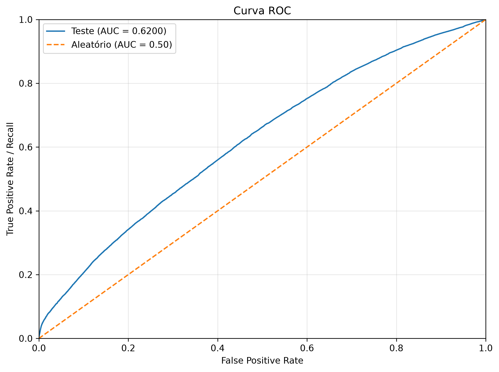
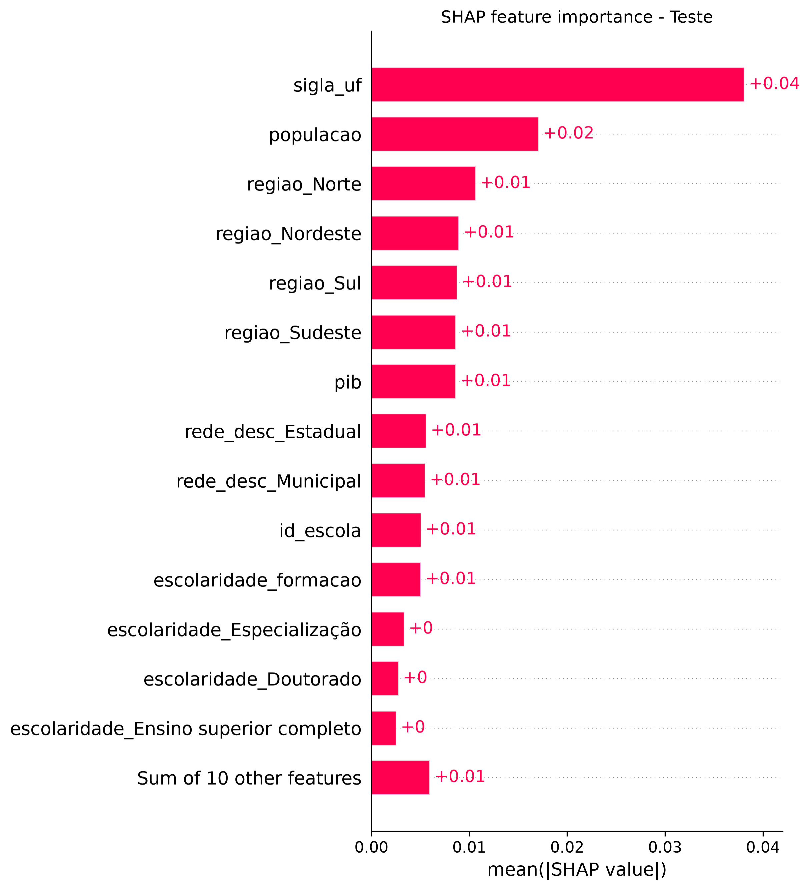

# tech-challenge-3

## Links de referência

[Vídeo Executivo do Projeto](https://youtu.be/jeZyzEgxn9c)

[Slides Executivo](https://docs.google.com/presentation/d/1LvTS0rlDDZeTQI_gu8rc2hOUsTo8ZJxllfBieKpVeIA/edit?usp=sharing)


## Contexto e objetivo

O objetivo deste projeto é construir e avaliar modelos supervisionados capazes de estimar a probabilidade de um aluno ser classificado como **alfabetizado**. A solução também identifica fatores territoriais, socioeconômicos e administrativos associados ao resultado, produzindo insumos para priorização de políticas educacionais.

O projeto responde, em especial, às seguintes perguntas:

- Quais características têm maior associação com a alfabetização?
- Quais territórios concentram maior risco educacional?
- O modelo treinado em um período mantém desempenho em um período futuro?
- Como os resultados podem orientar a alocação de recursos e o acompanhamento de redes de ensino?

## Dados utilizados

A base principal é a camada Gold construída na Fase 2, no nível de aluno, com registros de 2023 e 2024. Ela reúne o Indicador Criança Alfabetizada, informações territoriais, rede de ensino, metas e indicadores de município, UF e Brasil.

Para ampliar a capacidade analítica, a base foi enriquecida com dados municipais do IBGE:

| Fonte/atributo | Uso no projeto |
| --- | --- |
| PIB municipal | Proxy de contexto econômico. Para reduzir risco temporal, é associado ao ano anterior ao da observação do aluno. |
| População municipal | Caracterização demográfica do território no ano da observação. |
| Perfil do gestor educacional municipal | Características administrativas, escolaridade e formação; atributos sensíveis foram excluídos. |

O notebook de enriquecimento usa junções `m:1`, evitando multiplicação indevida de registros, e verifica cobertura dos dados externos. A base final de modelagem está em `data/sample/data_sample_modeling.parquet`, com **386.816 registros**: 174.743 de 2023 e 212.073 de 2024. A variável-alvo é `alfabetizado`, com classes próximas do equilíbrio (51,3% de alunos alfabetizados na amostra).

> Os dados de aluno são usados exclusivamente para fins acadêmicos. Identificadores individuais não são usados como atributos de predição.

## Estrutura do repositório

```text
.
├── data/
│   ├── ano=2023/ e ano=2024/     # dados da camada Gold
│   └── sample/                    # amostra e base enriquecida para modelagem
├── src/
│   ├── preprocessing/             # preparação de dados reutilizável
│   ├── modeling/                  # treinamento e seleção de modelos
│   ├── evaluation/                # métricas e avaliação
│   └── visualization/             # visualizações de resultados
├── Notebooks/
│   ├── EDA.ipynb
│   ├── join_external_data.ipynb
│   ├── modelo_alfabetizacao.ipynb
│   └── images/                    # artefatos visuais gerados pelos notebooks
├── reports/                       # relatórios e entregáveis analíticos
├── requirements.txt
├── .gitignore
└── README.md
```

## Como reproduzir

Pré-requisitos: Python 3.11+ e Git.

```bash
git clone https://github.com/EduardoShoiti/tech-challenge-3.git
cd tech-challenge-3
python -m venv .venv
```

Ative o ambiente virtual e instale as dependências:

```bash
# Windows (PowerShell)
.venv\Scripts\Activate.ps1

# macOS/Linux
source .venv/bin/activate

pip install -r requirements.txt
```

Execute os notebooks na ordem abaixo a partir da raiz do repositório. Os notebooks detectam automaticamente se foram iniciados pela raiz ou pela pasta `Notebooks`.

1. `Notebooks/EDA.ipynb` — entendimento da base e geração da amostra estratificada.
2. `Notebooks/join_external_data.ipynb` — integração de PIB, população e dados de gestores; gera `data_sample_modeling.parquet`.
3. `Notebooks/modelo_alfabetizacao.ipynb` — treinamento, seleção, avaliação e interpretabilidade.

Como alternativa aos notebooks, o fluxo de treinamento do modelo já selecionado pode ser executado pelo orquestrador:

```bash
python -m src.pipeline
```

Por padrão, a execução utiliza a base enriquecida de `data/sample/`, treina o Random Forest com os hiperparâmetros encontrados no notebook e grava métricas, importância por permutação e gráficos em `reports/modeling/`. Use `python -m src.pipeline --help` para as opções disponíveis.

## Análise exploratória e hipóteses

A EDA avalia qualidade dos dados, duplicidade, valores ausentes, cardinalidade, distribuição do alvo, taxas de alfabetização por região/UF/rede/ano e correlações numéricas. Também apresenta rankings descritivos de municípios e escolas com maior concentração de não alfabetizados.

Os principais achados que orientaram a modelagem foram:

- a variável alvo está balanceada, dispensando técnicas de reamostragem como requisito inicial;
- há heterogeneidade territorial por região e UF, justificando a inclusão de atributos geográficos;
- `proficiencia`, `presenca`, `preenchimento_caderno` e `caderno` estão diretamente relacionados à aplicação/resultado da prova e não são adequados para uma previsão acionável antes da avaliação, pois podem causar leakage;
- indicadores agregados de alfabetização e metas do mesmo período também podem carregar informação posterior ou excessivamente próxima ao rótulo.

Rankings territoriais devem ser interpretados em conjunto com o número de alunos observados. Taxas extremas de escolas ou municípios muito pequenos não devem, isoladamente, orientar decisões de política pública.

## Modelagem e prevenção de data leakage

O problema é tratado como uma classificação binária, em que `1` representa aluno alfabetizado e `0`, não alfabetizado.

Para testar generalização temporal, o experimento respeita a seguinte separação:

| Conjunto | Período | Finalidade |
| --- | --- | --- |
| Treino | 80% dos registros de 2023 | Ajuste dos modelos e pré-processamento. |
| Validação | 20% dos registros de 2023, estratificados pelo alvo | Comparação de modelos e definição de threshold. |
| Teste | 2024 completo | Avaliação final, consultada apenas após as decisões de desenvolvimento. |

Além da separação temporal, são removidos o alvo, identificadores sem capacidade de generalização (`id_aluno`, `id_municipio`, `codigo_uf` e `rede`), a coluna temporal de corte e atributos com risco de vazamento. Entre estes estão medidas da própria prova, agregados de resultado de alfabetização e metas futuras. Colunas constantes no treino também são excluídas.

O pré-processamento faz parte do `Pipeline` do scikit-learn, portanto é ajustado somente nos dados de treino em cada fold de validação cruzada. Ele combina:

- one-hot encoding para `regiao`, `rede_desc` e `escolaridade`;
- frequency encoding para variáveis categóricas de maior cardinalidade, como escola, UF, órgão gestor e formação;
- padronização de PIB e população;
- preservação das demais variáveis elegíveis para o modelo.

Os valores ausentes são quantificados na EDA e mantidos sob controle no fluxo de pré-processamento; a estratégia de imputação deve ser explicitamente aplicada dentro do pipeline em futuras iterações antes de uma implantação produtiva.

## Algoritmos e validação

Foram comparados cinco modelos: Regressão Logística, Árvore de Decisão, Random Forest, LightGBM e Gaussian Naive Bayes. A comparação inicial é feita com validação cruzada estratificada de 5 folds somente sobre o conjunto de treino de 2023. Em seguida, os hiperparâmetros são otimizados com Optuna (TPE), usando ROC AUC como métrica de seleção.

| Modelo | ROC AUC CV — baseline | ROC AUC CV — otimizado |
| --- | ---: | ---: |
| LightGBM | 0,6550 | **0,6621** |
| Random Forest | 0,6407 | 0,6567 |
| Árvore de Decisão | 0,6365 | 0,6504 |
| Regressão Logística | 0,5496 | 0,5526 |
| Gaussian Naive Bayes | 0,5477 | 0,5481 |

Embora o LightGBM tenha a maior média de CV, o **Random Forest** foi escolhido como modelo final porque obteve a maior ROC AUC no conjunto de validação temporal independente de 2023 (**0,6573**, versus 0,6554 do LightGBM). A decisão privilegia desempenho fora dos folds usados na otimização.

O threshold operacional é definido exclusivamente na validação, buscando o maior recall com precision mínima de 60%. O valor selecionado foi **0,4944** e foi mantido fixo no teste de 2024.

## Resultados

### Validação e teste do modelo selecionado

| Conjunto | Recall | Precision | F1-score | Accuracy | ROC AUC | KS | Average Precision |
| --- | ---: | ---: | ---: | ---: | ---: | ---: | ---: |
| Validação (2023) | 0,6641 | 0,6000 | 0,6304 | 0,6090 | 0,6573 | 0,2240 | 0,6602 |
| Teste (2024) | 0,5363 | 0,6080 | 0,5699 | 0,5774 | 0,6200 | 0,1645 | 0,6407 |

O desempenho no teste é menor que na validação, comportamento compatível com a mudança de período. Esse resultado é reportado de forma transparente: o modelo apresenta capacidade de discriminação moderada e pode apoiar triagem e priorização, não substituir a avaliação pedagógica individual.

#### ROC-AUC:


#### SHAP:



## Interpretabilidade e insights

A interpretabilidade é analisada por importância por permutação e SHAP, nos conjuntos de validação e teste. No teste de 2024, os atributos com maior importância por permutação foram:

1. `sigla_uf`;
2. `regiao`;
3. `populacao`;
4. `rede_desc`;
5. `escolaridade`;
6. `pib`.

O resultado indica que o contexto territorial e socioeconômico tem papel relevante na previsão. Essa é uma associação preditiva, não uma relação causal: não se deve concluir que um atributo territorial causa alfabetização. A interpretação deve orientar investigações e políticas focalizadas, combinadas com conhecimento pedagógico local.

## Aplicação para políticas públicas

O modelo pode apoiar gestores a:

- priorizar municípios, redes e territórios com maior probabilidade agregada de não alfabetização;
- direcionar busca ativa, reforço pedagógico e apoio técnico antes da avaliação seguinte;
- cruzar risco predito com capacidade da rede e contexto socioeconômico para orientar recursos;
- monitorar alterações de padrão entre anos e reavaliar o modelo periodicamente;
- investigar desigualdades regionais sem expor ou estigmatizar alunos individuais.

Uma utilização responsável deve operar no nível agregado para planejamento, preservar a privacidade e submeter decisões individuais à avaliação de profissionais da educação.

## Limitações

- A base de modelagem disponível no repositório é uma amostra estratificada; resultados podem variar ao usar a base integral.
- O alvo deriva da própria avaliação de alfabetização; variáveis disponíveis apenas durante ou após a prova foram removidas para preservar utilidade preditiva, reduzindo deliberadamente o sinal disponível.
- AUC de teste de 0,620 indica poder discriminativo moderado, não um mecanismo de decisão automática.
- O perfil de gestor é de 2021, que é o dado mais atualizados disponível, e pode não representar integralmente a configuração administrativa de 2023/2024. Porém utilizamos como proxy de gestão durante os anos.
- Importâncias globais não estabelecem causalidade e podem refletir desigualdades estruturais.
- É necessário monitorar drift temporal, cobertura das fontes externas, vieses por território e métricas desagregadas antes de uso operacional.

## Próximas evoluções

- testar validação por grupos geográficos/escolas, além do corte temporal;
- incorporar fontes prévias à avaliação, como indicadores de trajetória escolar e infraestrutura, quando disponíveis e adequados;
- calibrar probabilidades e definir thresholds por custo de intervenção;
- gerar painel agregado de risco com tamanho mínimo de amostra e monitoramento por período;
- versionar dados, modelo e experimentos para viabilizar reprodutibilidade contínua.

## Boas práticas de desenvolvimento

O projeto utiliza Git com histórico de commits, branches de desenvolvimento e pull requests. Os notebooks preservam os resultados das execuções principais e adotam `random_state=42` para permitir repetição dos experimentos. A avaliação final é separada do processo de tuning para reduzir otimismo na estimativa de generalização.
